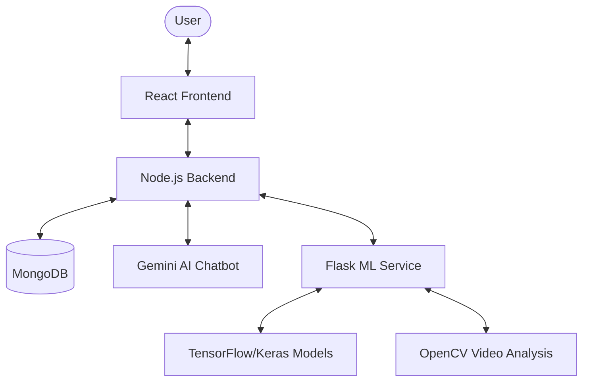

# 🌱 GreenID - AI-Powered Green Activity Verification

GreenID is a comprehensive platform designed to encourage and verify environmentally friendly activities. By leveraging modern web technologies and Machine Learning models, GreenID provides a robust system for users to log their green contributions and receive automated verification.

---

## 🏗 Project Architecture

GreenID follows a decoupled architecture consisting of three main components:

1.  **Frontend**: A responsive React application built with Vite.
2.  **Backend**: A Node.js/Express server handling authentication, data management, and orchestration.
3.  **ML Service**: A Python/Flask microservice that performs specialized verification using AI models.



---

## ✨ Key Features

### 🔐 User & Admin Management
- **Secure Authentication**: JWT-based login and signup.
- **Profile Management**: Users can maintain their green profiles.
- **Admin Dashboard**: Specialized interface for administrators to monitor all activities and user profiles.

### 📝 Activity Logging with ML Verification
GreenID supports various green activities, each verified by a dedicated AI model:
- **🥾 Walk Verification**: Uses Haversine formula to verify GPS coordinates and distance.
- **🚌 Public Transport**: Image classification (MobileNetV2) to identify buses, metros, and auto-rickshaws.
- **🌳 Tree Planting**: Advanced video analysis to verify the actual act of planting a tree.
- **🧹 Cleanup Drive**: Before-and-after image comparison to verify site cleaning.

### 🤖 HariBaba AI Chatbot
An intelligent chatbot powered by Google's Gemini AI to assist users with green living tips and platform guidance.

---

## 🛠 Technology Stack

### Frontend
- **Framework**: React.js (Vite)
- **Styling**: Vanilla CSS, React Toastify
- **Routing**: React Router DOM

### Backend
- **Runtime**: Node.js
- **Framework**: Express.js
- **Database**: MongoDB (Mongoose ODM)
- **AI Integration**: Google Generative AI (@google/generative-ai)
- **File Handling**: Cloudinary, Multer

### ML Service
- **Framework**: Python / Flask
- **Deep Learning**: TensorFlow, Keras
- **Computer Vision**: OpenCV
- **Models**: MobileNetV2, YOLOv8 (for object detection)

---
## Project Images 

- ### **Landing-Page**
  
  
  
  
  
  
### **Further UI is still in developing stage**

- ### **Login**
  

- ### **Profile**
  
- ### **Activity-Log**
  
  
- ### **Admin-Panel**
  
  

## ⚙️ Setup & Installation

### Prerequisites
- Node.js (v18+)
- Python (v3.9+)
- MongoDB (Running instance)

### 1. Clone the repository
```bash
git clone <repository-url>
cd GreenID
```

### 2. Backend Setup
```bash
cd Backend
npm install
```
Create a `.env` file in the `Backend` directory:
```env
MONGO_URI=your_mongodb_uri
PORT=5000
GEMINI_API_KEY=your_google_api_key
CLOUDINARY_CLOUD_NAME=your_name
CLOUDINARY_API_KEY=your_key
CLOUDINARY_API_SECRET=your_secret
```
Run the server:
```bash
npm run dev # using nodemon
```

### 3. ML Service Setup
```bash
cd ML_Models
pip install -r requirements.txt
```
Run the Flask service:
```bash
python ml_service.py
```

### 4. Frontend Setup
```bash
cd FrontEnd
npm install
npm run dev
```

---

## 📁 Project Structure

```text
GreenID/
├── Backend/            # Express server & MongoDB logic
│   ├── config/         # Database and session configs
│   ├── controllers/    # Route handlers
│   ├── models/         # Mongoose schemas
│   └── routes/         # API endpoints
├── FrontEnd/           # React application
│   ├── src/
│   │   ├── admin/      # Admin specific components/pages
│   │   ├── components/ # Reusable UI components
│   │   └── pages/      # User-facing pages
├── ML_Models/          # Python microservice
│   ├── PublicTransport/# Transport classification model
│   ├── planting/       # Video analysis modules
│   └── cleanup/        # Image comparison logic
└── README.md           # Documentation
```

---

## 🤝 Contributing
Contributions are welcome! Please open an issue or submit a pull request for any improvements.

## 📄 License
This project is licensed under the ISC License.
